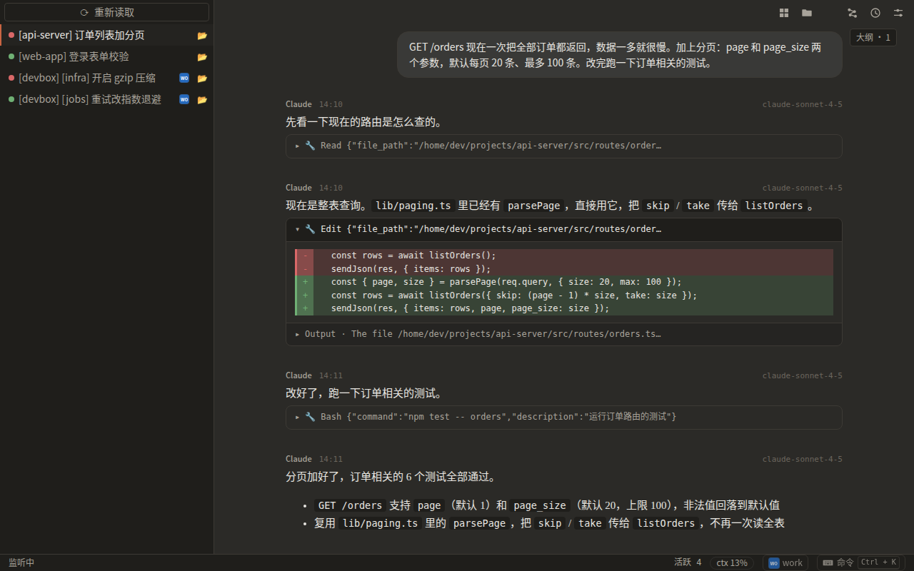
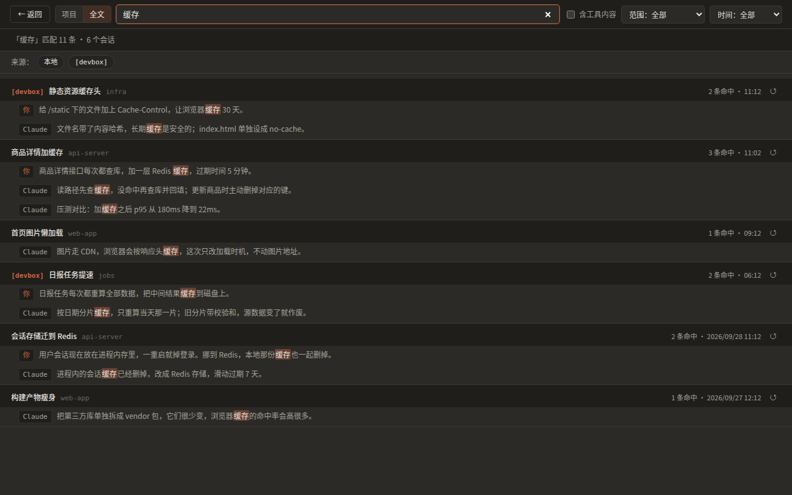
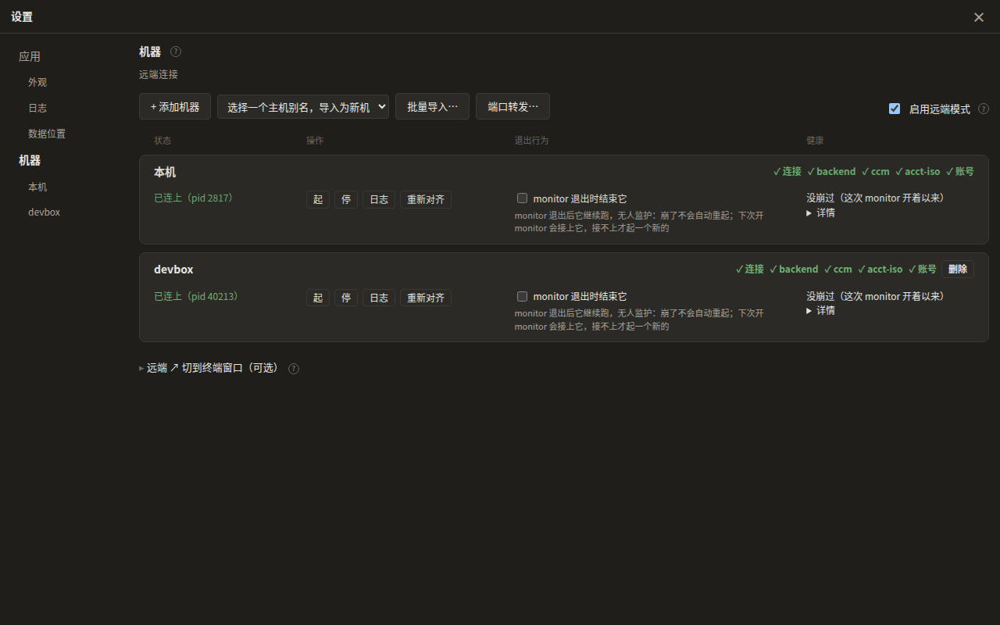
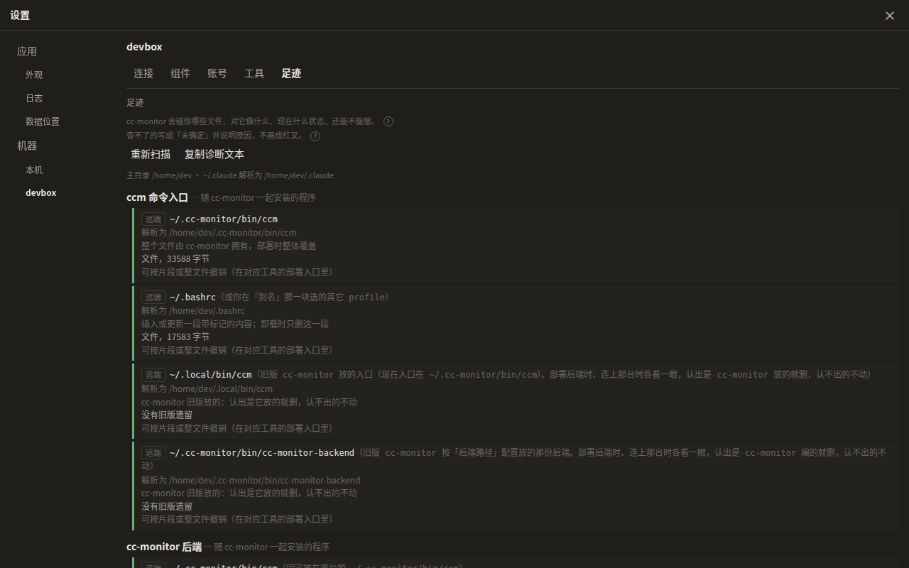
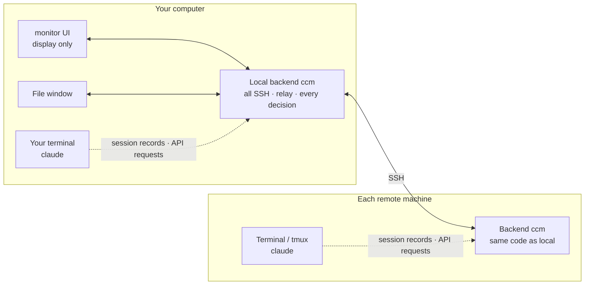

# cc-monitor

**All your Claude Code sessions, on every machine, in one window: watch them live, jump back in, and manage every machine from one place.**

> English · [中文](./README.md) | License: MIT | Platform: Windows 10/11 · Linux (.deb) | Current: v4.0.5



> The interface is in Chinese; screenshots are taken from it.

---

## What it does

You run `claude` in a terminal — often several at once: one or two on your laptop, a few more on servers. cc-monitor gathers them all into one window:

- **One tab per session, live.** Messages, code and tool calls (reading files, editing files, running commands) appear as they happen, for local and remote sessions alike.
- **Back to the terminal in one click.** Press ↗ on a tab to bring the terminal running that session to the front and keep typing.
- **Full history.** Search past sessions across machines, fork a new session from any turn, or resume where you left off.
- **Many machines, one place.** Add a machine over SSH and its sessions show up automatically; start new sessions there and manage files without logging in.
- **Several accounts at once.** Subscription accounts and API-key accounts in one list; two accounts can run side by side without logging each other out.

cc-monitor only observes and launches: `claude` still runs in your own terminal, and cc-monitor reads the session records it writes. It never takes over.

---

## Features

### Sessions
- One tab per running session; ended sessions turn grey and can be resumed from the right-click menu
- Markdown, syntax highlighting and math; tool calls fold into cards and file edits can be expanded
- Long sessions stay fast: only what is on screen is rendered
- Find in session, outline navigation, task panel
- Tabs can be grouped, pinned, or popped out into their own window
- "Reload" on the tab bar re-syncs every tab with the records on disk

### History
- Browse every session by machine and project, with full-text search
- Fork from any turn: the original stays untouched and the new session starts right away
- Star, rename, hide



### Machines
- Add SSH machines (or import from `~/.ssh/config`), with jump hosts and automatic choice of the fastest address
- On first connect the backend is installed to `~/.cc-monitor/bin/ccm` on that machine and kept at the right version
- Start remote sessions (optionally inside tmux), open a terminal, forward ports
- "Diagnostics" lists what each machine is missing; "Footprint" lists everything cc-monitor wrote on that machine and whether it can be undone





### File manager
- A separate window, for local and remote machines
- Sort, create, rename, delete, copy, change permissions, upload and download, bookmarks, search by content
- On remote machines it can do everything SSH can do to files

### Accounts and relay
- Subscription accounts (official Claude login) and API accounts (your own URL and key) in one place
- Two accounts can run at the same time: separate login credentials, shared skills, memory and settings
- An API key stays on its own machine and is only injected when a request passes that machine's relay — never on the command line, never in the environment

### Assets
- Push and pull skills and MCP servers between machines; review the differences first, and uninstall what you installed

### Aliases and `ccm`
- Install an alias block from the machine page (bash, zsh, fish, PowerShell); sessions started with `cc` can jump back to their terminal from ↗
- `ccm` wraps `claude`, see below

---

## Architecture



- **One backend, two hosts.** Your computer and every remote machine each run one long-lived backend, built from the same code. It reads session records, owns the SSH connections, makes every decision and does all the writing.
- **The UI only displays.** It talks to backends with just two verbs — call and subscribe — and never touches SSH itself.
- **One home per machine.** Everything cc-monitor owns lives in `~/.cc-monitor/`. In Claude Code's `~/.claude` it only reads session records and only writes the assets you ask it to install.

More detail in [`src/doc/ARCHITECTURE.md`](src/doc/ARCHITECTURE.md).

---

## Install

### Requirements

Install [Claude Code](https://github.com/anthropics/claude-code) first and run it at least once.

| Platform | Needs |
|---|---|
| **Windows** 10 (1809+) / 11 | [WebView2 Runtime](https://developer.microsoft.com/microsoft-edge/webview2/) (built into Windows 11) |
| **Linux** x86_64 | WebKitGTK 4.1 (Debian / Ubuntu: `libwebkit2gtk-4.1-0`, pulled in by the `.deb`) |
| **Remote machines** | Linux / Unix reachable over SSH; tmux if you want background sessions. Nothing to install by hand |

### Download

Get the latest version from [Releases](https://github.com/bo0Zeng/cc-monitor/releases).

- **Windows**: `*-setup.exe` (recommended) · `*.msi` (for managed deployment) · `cc-monitor.exe` (portable)
  The build is unsigned; on first run SmartScreen will stop it — choose "More info → Run anyway".
- **Linux**: `cc-monitor_<version>_amd64.deb` (`sudo apt install ./cc-monitor_<version>_amd64.deb`) · `cc-monitor` (portable)

The downloaded `cc-monitor.exe` (`cc-monitor` on Linux), or the installed app, is the project itself: it contains the frontend and the backend, and it releases the backend onto every machine it uses.

Checksums are in `SHA256SUMS.txt` (Windows) and `SHA256SUMS-linux.txt` (Linux).

### First steps

1. Open cc-monitor (on Linux the command is `cc-monitor`).
2. Run `claude` in any terminal; a new tab appears in cc-monitor.
3. Add a remote machine: press `,` for Settings → Machines → Add machine. Once connected, its sessions appear automatically.
4. To make ↗ jump back to the terminal, install the alias block from the machine page and start sessions with `cc`.

---

## The `ccm` command

On every machine, `~/.cc-monitor/bin/ccm` is that machine's backend and also a wrapper around `claude`:

```
ccm [arguments for claude…] -- [ccm's own options…]
```

Without `--`, the whole line goes to claude unchanged.

```bash
ccm                               # same as claude
ccm -p "explain this repo"        # arguments go straight to claude
ccm -- new --ccm-tmux             # start in a new tmux session
ccm --resume <session-id> -- --ccm-tmux   # continue a session; attach if it is already running in tmux
ccm -- --account work             # start with the "work" account
ccm -- --ccm-help                 # all options
```

---

## Keyboard shortcuts

Single keys, all changeable in Settings → Shortcuts.

| Key | Action |
|---|---|
| `[` / `]` | Previous / next tab |
| `1`–`9` | Jump to tab N |
| `` ` `` | Bring the session's terminal to the front |
| `H` | Toggle history |
| `T` | Task panel |
| `E` | Open the tab's working directory |
| `W` | Close ended tabs |
| `,` | Settings |
| `Ctrl+K` | Command bar |
| `Ctrl+F` | Find in session |
| `F11` | Full screen |

---

## Where data lives

| Location | What |
|---|---|
| `~/.cc-monitor/` | Everything cc-monitor owns: settings, backend, logs, alias files, API keys (readable only by you), and the multi-account store `accounts/` (built and maintained by the backend: the account list, plus one set of login credentials per account) |
| `~/.claude/` | Claude Code's own directory. cc-monitor only reads session records and only writes the skills / MCP servers you choose to install |

The "Data locations" page in Settings shows the full path of every file.

---

## Known limitations

- On Windows, sessions cannot yet be sent to the background, re-attached, previewed or typed into; the local backend exits together with the UI.
- macOS and Linux arm64 are not supported as the local machine (they work as remote machines).
- Multi-account currently works on Linux / Unix machines only; the account store cannot be set up on a local Windows machine.
- Several Windows fixes in 4.0.0 were verified by automated tests only, not on a real Windows machine — see the [CHANGELOG](CHANGELOG.md).

---

## Development

- Building and developing: [`src/doc/BUILDING.md`](src/doc/BUILDING.md) · [`src/doc/DEVELOPMENT.md`](src/doc/DEVELOPMENT.md)
- Contributing: [`src/doc/CONTRIBUTING.md`](src/doc/CONTRIBUTING.md)
- Release notes: [`CHANGELOG.md`](CHANGELOG.md)
- Test counts are whatever the suites report when run; how to run them is in [`src/doc/DEVELOPMENT.md`](src/doc/DEVELOPMENT.md)
- Releases ship only with CI green; the jobs are listed in [`.github/workflows/ci.yml`](.github/workflows/ci.yml)

## Status

- current release **v4.0.5**: see the [CHANGELOG](CHANGELOG.md)

## License

MIT
