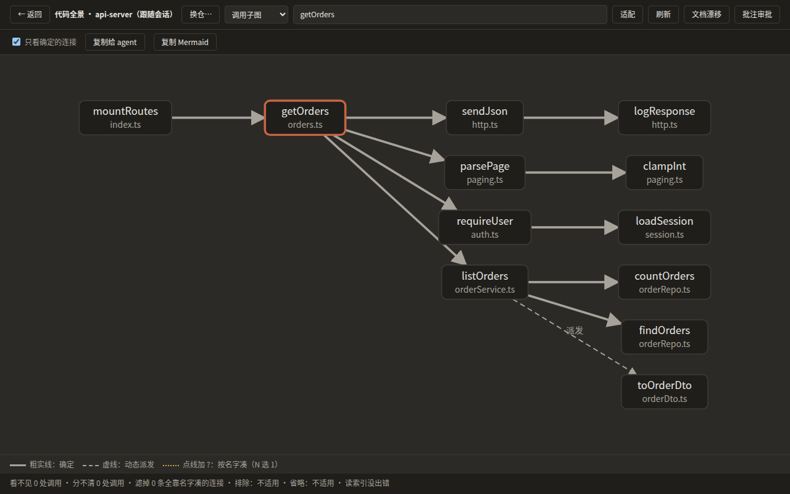
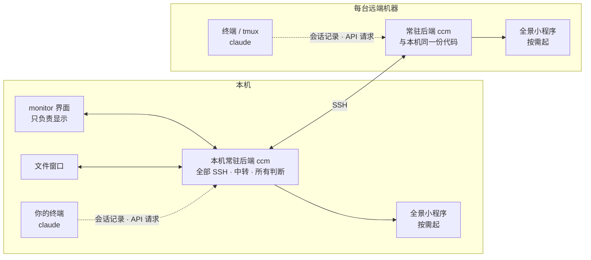

# cc-monitor

**把你在各台机器上跑的 Claude Code 会话收进一个窗口：实时看、随时接着用、一处管好所有机器。**

> [English](./README.en.md) · 中文 | License: MIT | 平台: Windows 10/11 · Linux（.deb） | 当前版本: v4.0.0


---

## 它是干嘛的

你在终端里跑 `claude`，可能同时开着好几个：本机一两个，服务器上还有几个。cc-monitor 把它们全收进一个窗口：

- **每个会话一个 tab，实时显示**。对话、代码、工具调用（读文件、改文件、跑命令）逐字出现，本机和远端一样。
- **一键回到那个终端**。点 tab 上的 ↗，就切到跑着这个会话的终端窗口，接着敲。
- **历史都在**。跨机器搜索过去的会话，从任意一轮分叉出新会话，或者 resume 接着聊。
- **多台机器一处管**。添加 SSH 机器之后，那台上的会话自动出现；在那台开新会话、管文件、看代码结构，都不用登上去。
- **多个账号同时跑**。订阅号和 API 号统一管理，两个号可以同时开会话、互不掉登录。

cc-monitor 只是观察者和启动器：`claude` 仍然跑在你自己的终端里，cc-monitor 读它写下的会话记录来显示，不接管它。

---

## 功能

### 会话
- 每个正在跑的会话一个 tab；会话结束后 tab 变灰，右键可以 Resume
- Markdown、代码高亮、数学公式；工具调用折叠成卡片，文件改动能展开看
- 长会话不卡：只渲染看得见的部分
- 会话内查找、大纲跳转、Task 面板
- tab 可以分组、固定、拖出成独立窗口
- tab 栏上的「重新读取」一键让所有 tab 与磁盘上的记录重新对齐

### 历史
- 按机器、按项目浏览全部会话，全文搜索
- 从任意一轮分叉：原会话不动，新会话直接起起来
- 星标、改名、隐藏


### 机器
- 添加 SSH 机器（可从 `~/.ssh/config` 导入），支持跳板机和多地址自动选快的那条
- 第一次连上时自动把后端装到那台的 `~/.cc-monitor/bin/ccm`，版本不对会自动换
- 在远端开新会话（可放进 tmux）、打开终端、端口转发
- 「诊断」列出每台机器还差什么；「足迹」列出 cc-monitor 在这台机器上写过什么、能不能撤


### 文件管理器
- 独立窗口，本机和远端都能开
- 排序、新建、改名、删除、复制、改权限、上传下载、书签、按内容搜索
- 远端能做 SSH 上能对文件做的全部操作

### 代码全景
- 在仓所在的那台机器上现场解析代码，界面只收结果；本机和远端的仓都能看
- 模块图、子系统图、调用子图、类型图；图下常驻一行说明看不见多少、分不清多少
- 在图上批注，把选中的部分复制给 agent



### 账号与中转
- 订阅号（Claude 官方登录）与 API 号（自选 URL ＋ key）统一管理
- 两个号同时跑：各自一份登录凭据，skill、记忆、设置共享同一份
- API 号的 key 只留在它所在的那台机器上，请求经那台的中转转发时才注入，不进命令行、不进环境变量

### 资产
- skill 和 MCP 可以在机器之间推拉；装之前先看差异，装上的可以卸

### 别名与 `ccm`
- 机器页一键装别名块（bash、zsh、fish、PowerShell），用 `cc` 起的会话能从 tab ↗ 跳回终端
- `ccm` 是 `claude` 的壳，见下文

---

## 架构



- **一份后端，两种宿主**。本机和每台远端各跑一个常驻后端，是同一份代码。它读会话记录、管 SSH 连接、做全部判断，也负责写文件。
- **界面只负责显示**。界面对后端只有两个动作：问一次（call）和订阅（subscribe）。界面进程自己不碰 SSH。
- **代码全景就地计算**。在仓所在的那台机器上解析，线上只传结果，源码不离开那台机器。
- **一台机器一个家**。cc-monitor 自己的东西都放在 `~/.cc-monitor/`；对 Claude Code 的 `~/.claude` 只读会话，只写你点名要装的资产。

更细的说明见 [`src/doc/ARCHITECTURE.md`](src/doc/ARCHITECTURE.md)。

---

## 安装

### 系统要求

先装好 [Claude Code](https://github.com/anthropics/claude-code)，并至少跑过一次。

| 平台 | 要求 |
|---|---|
| **Windows** 10（1809+）/ 11 | [WebView2 Runtime](https://developer.microsoft.com/microsoft-edge/webview2/)（Windows 11 自带） |
| **Linux** x86_64 | WebKitGTK 4.1（Debian / Ubuntu：`libwebkit2gtk-4.1-0`，`.deb` 会自动装） |
| **远端机器** | Linux / Unix，能 SSH 登录；想在后台跑会话就装 tmux。不用手动装任何东西 |

### 下载

从 [Releases](https://github.com/bo0Zeng/cc-monitor/releases) 下载最新版。

- **Windows**：`*-setup.exe`（推荐）· `*.msi`（适合批量部署）· `monitor.exe`（免安装）
  未签名，第一次运行时 SmartScreen 会拦，点「更多信息 → 仍要运行」。
- **Linux**：`cc-monitor_<版本>_amd64.deb`（`sudo apt install ./cc-monitor_<版本>_amd64.deb`）· `monitor`（免安装）

校验和在 `SHA256SUMS.txt`（Windows）与 `SHA256SUMS-linux.txt`（Linux）。

### 上手

1. 打开 cc-monitor（Linux 上的命令是 `monitor`）。
2. 在任意终端里跑 `claude`，cc-monitor 里就多出一个 tab。
3. 加远端机器：按 `,` 打开设置 → 机器 → 添加机器。连上之后，那台上的会话会自动出现。
4. 想让 tab 上的 ↗ 跳回终端：在机器页装别名块，之后用 `cc` 起会话。

---

## `ccm` 命令

每台机器上的 `~/.cc-monitor/bin/ccm` 就是那台的后端，也是 `claude` 的壳：

```
ccm [交给 claude 的参数…] -- [ccm 自己的选项…]
```

没有 `--` 时整行原样交给 claude。

```bash
ccm                               # 等于 claude
ccm -p "解释一下这个仓"            # 参数原样交给 claude
ccm -- new --ccm-tmux             # 在一个新的 tmux 会话里起
ccm --resume <会话ID> -- --ccm-tmux  # 接着上次的会话；已经在 tmux 里跑着就直接接上
ccm -- --account work             # 用 work 这个账号起
ccm -- --ccm-help                 # 全部选项
```

---

## 快捷键

单键即用，全部可以在「设置 → 快捷键」里改。

| 键 | 作用 |
|---|---|
| `[` / `]` | 上一个 / 下一个 tab |
| `1`–`9` | 跳到第 N 个 tab |
| `` ` `` | 把对应的终端窗口切到前台 |
| `H` | 打开 / 关闭历史 |
| `G` | 打开 / 关闭代码全景 |
| `T` | Task 面板 |
| `E` | 打开当前 tab 的工作目录 |
| `W` | 关闭已结束的 tab |
| `,` | 设置 |
| `Ctrl+K` | 命令栏 |
| `Ctrl+F` | 在当前会话里查找 |
| `F11` | 全屏 |

---

## 数据放在哪

| 位置 | 放什么 |
|---|---|
| `~/.cc-monitor/` | cc-monitor 的一切：配置、后端、日志、别名文件、API 号的 key（只给本人读写） |
| `~/.claude/` | Claude Code 自己的目录。cc-monitor 只读会话记录，只写你点名要装的 skill / MCP |
| `~/.claude-alt/` | 多账号的账号库（由后端建立和维护），每个号一份登录凭据 |

设置里的「数据位置」页列出每个文件的完整路径。

---

## 已知限制

- Windows 上会话暂不能放后台、接回、看画面、往里送字；本机后端在 Windows 上随界面一起退出。
- macOS、本机 Linux arm64 不在支持范围内（可以把它们当远端机器连）。
- 多账号目前只支持 Linux / Unix 机器，Windows 本机上不能建账号库。
- 4.0.0 里几条 Windows 修复只经过自动化测试，没在真实 Windows 上复验，见 [CHANGELOG](CHANGELOG.md)。

---

## 开发

- 构建与开发：[`src/doc/BUILDING.md`](src/doc/BUILDING.md) · [`src/doc/DEVELOPMENT.md`](src/doc/DEVELOPMENT.md)
- 贡献：[`src/doc/CONTRIBUTING.md`](src/doc/CONTRIBUTING.md)
- 更新记录：[`CHANGELOG.md`](CHANGELOG.md)
- 各套测试的条数以实跑为准，跑法见 [`src/doc/DEVELOPMENT.md`](src/doc/DEVELOPMENT.md)
- 发版前 CI 全绿；有哪些 job 见 [`.github/workflows/ci.yml`](.github/workflows/ci.yml)

## 项目当前状态

- **版本**：v4.0.0（Released）
- 当前发布 **v4.0.0**：详见 [CHANGELOG](CHANGELOG.md)

## License

MIT
